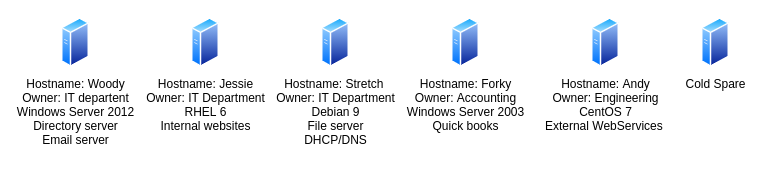
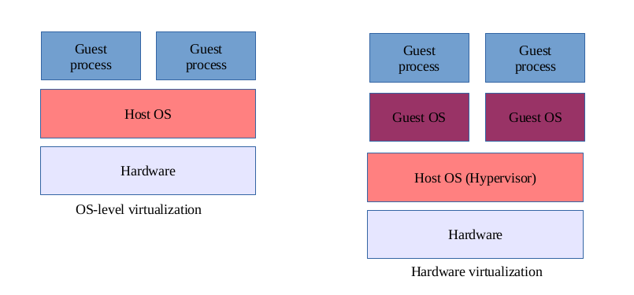
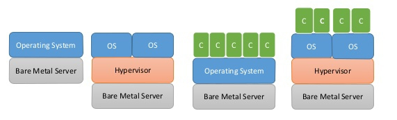

# Virtual Machines, Containers and Hypervisors-A primer on what to know

January 2021 Workshop

In today’s world of modern tech infrastructure nothing runs on bare-metal
anymore.Find out how buzzwords like Virtual Machines, Containers, Hypervisors,
provisioning and automation fit together and what they mean for you.

## Legal nonsense...

I, William Mantly am not representing JP Morgan Chase during this presentation.
JP Morgan Chase has in no way endorsed or vetted the content of this
presentation.

## About Me

**William Mantly Jr**

In depth knowledge of software development, System and network design with 20
years of industry experience. CompTIA A+ Certified.

Currently:
* Software/Networking engineer, VP on the Software-Defined Networking team At
	**JP Morgan Chase**
* Consultant for Infrastructure projects.

Former: 
* Instructor and developer at **Byte Academy**
* Development, DevOps and Operational roles

Contact:
* Discord: **william#5607**
* Gihub: **wmantly**
* Linkedin: **wmantly**
* Other social sites: Try **wmantly**, im the only one...

## Q&A

I will present a topic and take Q&A after each topic. I would like this to be
highly interactive.

I will also take Questions as issues submitted to this repo after the
presentation is done.

## Vocabulary

* **Bare-Metal** - Physical hardware.
* **Virtual Machines(VM)** - Emulated computer.
* **Container** - Isolated set of resources, sometimes interchangeable with VM.
* **Box** - Can refer to a real(Bare-Metal) server, VM or container. 
* **Host** - Bare-Metal server running VM's and/or containers.
* **Guest** - A VM or Container.
* **Hypervisor** - Operating System or software running a Bare-Metal hosts to
	assist in the management of VM's or containers.
* **Provisioning** - The act of setting up a box/app/service.
* **Drift** - Different in configuration or software versions between the
	intended state and actual state.
* **Capacity Planning** - Planing how much physical resources an app, team or
	organization needs and how they will be mapped to said physical resources.
* **Cloud** - Resources owned and managed by a 3rd party you can rent.
* **On Prem** - Resources owned and managed by you.
* **Multi Cloud** - Using multiple cloud offerings for one product.
* **hybrid Cloud** - Mixing On Prem and cloud offerings for one product.
* **Private Cloud** - Exposing On Prem servers as "rentable" resources.

## Pets, the traditional setup

Servers are pets. Each physical box is independently set up and managed. Most
have friendly names, like types of dinosaurs or movie characters. Each one is
often owned by an internal team. Each one also has custom set ups and unique 
quirks the Ops team knows personally.

Here are some of the down sides with this approach
* Drift - Staging and Production server become drifted making testing all but
	meaningless and bugs much harder to reproduce.
* Custom set up - Since each server is brought up manually, documentation
	becomes vague and outdated. Ops person also apply unknown patches and fixes
	to complete current goals, adding to drift.
* Time consuming - Since each server always need an individual persons
	attention, they are very time consuming to update(OS, vendor and internal
	apps).
* Capacity Planning - Each time a service or requirement is changed, the entire
	taxonomy of the resources need to replanned,
* Separation of concerns - Many apps and services are usably loaded on a single
	box, resulting in overlapping a conflicting dependences during install and
	updates.
* Backup and Restores - Because each box and service are unique, each one needs
	a custom back up and restore plan to be created and tested.
* Expense - The issues listed above, and many more, make this approach expensive
	as it take decent of man hours, often leaves a lot resources unused, and
	unplanned outages

## Cattle, The modern approach

Today, Ops teams do not think of the servers they manage as pets, but as cattle.
Instead of installing user ready Operating Systems on Bare-Metal, we install
Hypervisor designed solely to run managed VM's and/or containers. Bringing the
concept one step further, App teams are recommended, often required, to deploy
services via code, and do not have shell access into the environments they
deploy to. This also allows the Apps/services deployed to be thought of as
cattle.

Lets take a deeper look into what this means

### The Virtual Machine

Simply put, a VM is a logical(fake) computer that exists as software. Some VM's 
will emulate every aspect of the logical computer, allowing this fake computer
to run software that is incompatible with the hardware of the host. Most of
todays production VM's do not emulate anything and take advantage of built in 
features of the hosts CPU to isolate a subset of physical CPU, RAM and disk into
a logical computer, AKA a VM. Once you have VM, you need to install its own
Operating system and boot it. This can be only OS the CPU supports. You can
install Windows on a VM with a Linux host. If you emulate the CPU, you can
install something like the PowerPC version of macOS on a x86 Linux host, just
don't expect lighting fast performance.

Because of this, Ops teams can treat every VM in the infrastructure
the same way. 

* Drift - None on the physical side, but does nothing to address drift with the 
	apps and services running in the VM's.
* Custom set up - None with this set up.
* separation of concerns - Each app/service gets its own VM, no possibility of
	conflicts.
* Time efficient - Because each VM can be managed the same way, management is
	often done in bulk with scripts
* Capacity Planning, Backup and Restores - One backup and restore plan,
	capacity planing can be done on the fly, as VM's can be moved between
	physical hosts with no service interruption.
* Expense - We have brought man hours down and more efficiently use resources
	with less outages.

### How about Containers?

Containers on the surface are a lot like VM's. They are both used for resource
isolation. The big difference is how this is accomplished. Containers do not
create a logic computer, and emulation is never involved. The host Operating
System isolates processes to create what seems like separate system. From a
functional standpoint, they are often seen as a separate guest just as a VM
would be. The advantage with this up is there is no CPU/RAM/DISK overhead to
make a new container, as with a VM where you need an whole operating system
installed and running. The downside is a since a container is just process
isolation, apps and services need to be supported by the host OS and hardware.
Containers are generally installed on type of VM's to allow for greater
compatibility with physical hosts and more stream lined lower level management.

* Capacity Planning - Since containers take less over head and are generally
	lighter, we can squeeze that much more out of each box for business work
	loads.

### The last piece, Automation

In order to take full advantage of this cattle approach, we need wide spread
automation. In our modern environment, manual provisioning has no place. Every
application, service and the container/VM needs be created by automation.
Automation doesn't have to complex or scary, a bash or python script that calla
some API's to make a container, then installs packages and copies configuration
maybe all you need. This is also where the CI/CD(Continuous
Integration/Continuous Delivery) pipeline comes into play, automation to
automatically run your automation scripts!

* Drift - Automation scripts should always produce the same container/VM, and
	all but remove drift.
* Documentation - The automation scripts act as self documentation allowing
	others to know exactly how something is set up.
* Capacity Planning and Backup and Restores - Theses are also automated.

## More Detail

Lets take a deeper look look into some of the topics we have covered.

### Hypervisour

There are many commercial and open source Hypervisour to chose from. Most of
them are strip down versions of Linux with management tools, both CLI and GUI,
for VM's and offer the option to cluster bare-metal servers into one deployment
and management zone Some, like Microsoft's Hyper-V offering are just add-ons
to an existing windows server installs. One of the most popular products is
VMwares EXSi and vSphere witch offers a whole line of products for enterprise
visualization. The most popular open source offering is Proxmox, witch is built
on top of Debian Linux. All of these products offer about the services and cost 
from $0 to millions per year.

Links to Hypervisour: 

* [**Proxmox**](https://www.proxmox.com/en/proxmox-ve) - Powerful open-source
	server solutions. *My recommended platform*
* [**VMware**](https://www.vmware.com/products.html) - VMware offers dizzying
	amount of products and services. If you plan on going this route, plan to
	spend a lot of time figuring what you will need and how much it will cost.
	They also have a limited hardware support.
* [**MS Hyper-V**](https://docs.microsoft.com/en-us/virtualization/hyper-v-on-windows/about/) - Add-on to windows boxes.

### Virtual Machine

Virtualization has been around for a long time, going back to the 1960's. For
most of this time, virtualization was "full virtualization" where every aspect
of the logically created VM is emulated by software. This allows the VM to run
code built for non-committable hardware or using hardware completed emulated.
The downside to this approach is it is very resource intensive and slow making
it impracticable for production workloads. In the mid 2000's Intel and AMD
released CPU features, known as VT-X and AMD-V that allows isolation of physical
resources to a VM. No more emulation and workloads run at near native speed.
this is the turning point in the history of virtualization where it becomes
popular in production environments. As with Hypervisours, there are many open
source and commercial offerings.

Links:

* [**qemu**](https://www.qemu.org/) - Full emulation virtualization that can run
	number of CPU typed on a number CPU types. Almost all other modern
	virtualization has roots in this project.
* [**VirtualBox**](https://www.virtualbox.org/) - A desktop VM offering easy of
	use and fast performance. A great place to start with virtualization.
* [**KVM**](https://www.linux-kvm.org/page/Main_Page) - KVM is the backbone of
	modern server virtualization.

### Containers

Containers are not a new concept. The modern containers we think about and a
implementation of OS-level virtualization. On unix like systems, you can create
a container with [`chroot` command](https://en.wikipedia.org/wiki/Chroot). In
moderner infrastructure context, their are two types of containers, app-level
and and system-level. Docker is an example of app-level containers, as docker 
containers are designed to run single, stateless apps replicated across an
arbitrary about of container instances. LXC is an example of system-level
containers as an LXC container acts almost as a nested system in a bottle.
Containerizes are not generally directly deployed, we a intermediate management
tool call an `orchestrator`. Examples for orchestrator are Podmon for docker,
kubernetes witch can be configured to use a number of container technologies and
LXD for LXC containers. Orchestrators are generally deployed to VM's,
not bare metal.

Links:

* [**Kubernetes**](https://kubernetes.io/) - Open-source container-orchestration
system for automating computer application deployment, scaling, and management.
* [**Docker**](https://www.docker.com/) -  Containers as packages.

## More!

* [**The Phoenix Project**](https://www.amazon.com/Phoenix-Project-DevOps-Helping-Business/dp/0988262592) - A Novel about IT, DevOps, and Helping Your Business Win
* 